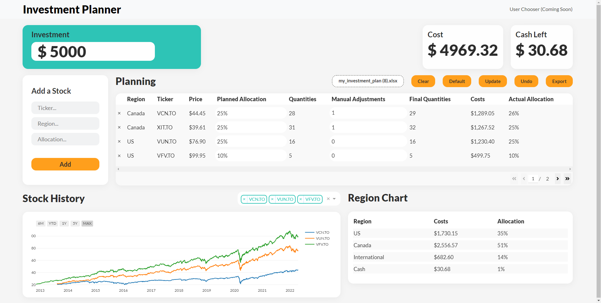

# Investment Planner

<a href="https://github.com/RCopJr/investment-planner-dash">
    
</a>

A Dash app that provides a dashboard to help organize one-time investments with a specified investment amount, percent allocations and manual adjustments: https://dash-investment-planner.herokuapp.com/
<br />
Users are also able to export and upload previously created plans, update stock prices, add and remove stocks from a plan, compare stock histories, and more.

### Dependencies

Inside of a python virtual environment run:

```
pip install -r requirements.txt
```

## Acknowledgements

- [Rachel Copreros](https://www.linkedin.com/in/rachel-joy-copreros-747b79219/) - UI Design
- [JR Copreros](https://www.linkedin.com/in/jrcopreros/) - Initial Idea
